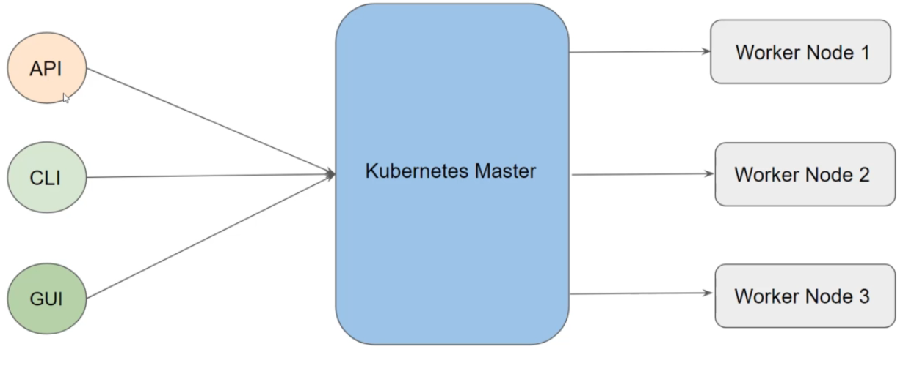

# Container Orchestration
Container orchestration is all about managing the life cycles of containers, especially in   
large, dynamic environments.

Container Orchestration can be used to perform lot of tasks, some of them includes:   
- Provisioning and deployment of containers   
- Scaling up or removing containers to spread application load evenly   
- Movement of containers from one host to another if there is a shortage of resources   
- Load balancing of service discovery between containers   
- Health monitoring of containers and hosts

## Orchestration solutions
There are many container orchestration solutions which are available, some of the   
popular ones include:   
- Docker Swarm   
- Kubernetes   
- Apache Mesos   
- Elastic Container Service (A WS ECS)   
There are also various container orchestration platforms available like EKS, AKS and GKE.

# Kubernetes
Kubernetes (K8s) is an open-source container orchestration engine developed by Google.   
It was originally designed by Google, and is now maintained by the Cloud Native Computing   
Foundation.

## K8s Architecture

## K8s Installation
There are multiple ways to get started with fully functional kubernetes environment   
1. Use the Managed Kubernetes Service
	 Various providers like AWS, IBM, GCP and others provides managed Kubernetes clusters.   
	 Most of the organizations prefers to make use of this approach.
2. Use Minikube
3. Install & Configure Kubernetes Manually (Hard Way)

# K8s components
- kubrctl

## Kubectl
The Kubernetes command-line tool, kubectl, allows you to run commands against Kubernetes   
clusters. 
You can use kubectl to deploy applications, inspect and manage cluster resources, and view logs.

To connect to the Kubernetes Master, there are two important data which kubectl needs:
1. DNS / IP of the Cluster
2. Authentication Credentials
and these details will be in kubeconfig file.

# K8s Objects
what is k8s onject?
..
There are various ways in which we can configure an Kubernetes Object.   
- First approach is through the kubectl commands.   
- Second approach is through configuration file written in YAML.
# POD
A Pod in Kubernetes represents a group of one or more application containers , and some shared
resources for those containers.

Containers within a Pod share an IP address and port space, and can find each other via localhost.

A - 

- Pod always runs on a Node.   
- A Node is a worker machine in Kubernetes.   
- Each Node is managed by the Master.   
- A Node can have multiple pods.