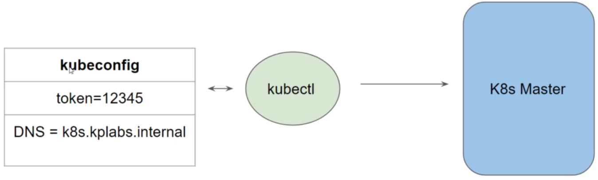
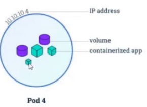
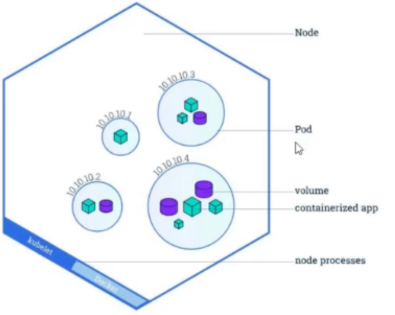
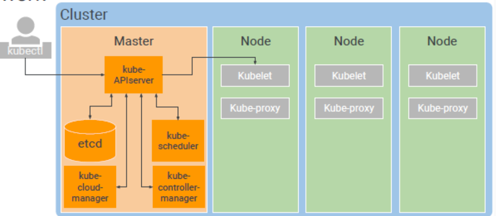

## K8s Installation
There are multiple ways to get started with fully functional kubernetes environment   
1. Use the Managed Kubernetes Service
	 Various providers like AWS, IBM, GCP and others provides managed Kubernetes clusters.   
	 Most of the organizations prefers to make use of this approach.
2. Use Minikube
3. Install & Configure Kubernetes Manually (Hard Way)

# K8s components
- kubectl

## Kubectl
The Kubernetes command-line tool, kubectl, allows you to run commands against Kubernetes   
clusters. 
You can use kubectl to deploy applications, inspect and manage cluster resources, and view logs.

To connect to the Kubernetes Master, there are two important data which kubectl needs:
1. DNS / IP of the Cluster
2. Authentication Credentials
and these details will be in kubeconfig file.

# K8s Objects
The resources we create in k8s are referred to as objects, like pods, service etc..
Once you create the object, the k8s system will constantly work on to ensure that object exists.

There are various ways in which we can configure an Kubernetes Object.   
- First approach is through the kubectl commands.   
- Second approach is through configuration file written in YAML.
	- Advantages of using config files
		- Integrates well with change review processes. 
		- Provides the source of record on what is live within the Kubernetes cluster. 
		- Easier to troubleshoot changes with version control. 
# POD
A Pod in Kubernetes represents a group of one or more application containers , and some shared
resources for those containers.

Containers within a Pod share an IP address and port space, and can find each other via localhost.

A - 

- Pod always runs on a Node.   
- A Node is a worker machine in Kubernetes.   
- Each Node is managed by the Master.   
- A Node can have multiple pods.

# K8S Architecture

K8s follows master and worker node architecture, master node manages the worker nodes and the workloads (Pods) in the cluster.
Master node (also referred as control plane) make global decisions about the cluster (for example, scheduling), as well as detecting and responding to cluster events, while worker nodes host the Pods that are the components of the application workload.

## K8S Components
**Master components**

| Component name           | Description                                                                                                    |
| :----------------------- | :------------------------------------------------------------------------------------------------------------- |
| kube-apiserver           | Component on the master that exposes the K8S API.                                                              |
| etcd                     | Database, that stores data in Key-vaule pairs for all cluster data.                                            |
| kube-scheduler           | component that watches newly created pods that have no node and assigned and selects a node for them to run on |
| kube-controller-manager  | Responsible for controlling various aspects, including node controller, replication controller etc..           |
| cloud-controller-manager | Runs controllers that interact with the underlying cloud providers.                                            |

**Worker Node components**
Component name | Description 
:-- |:-- 
kubelet |An agent that runs on each node in the cluster. it make sure the PODs are running in the node
kube-proxy | Acts as a network proxy which maintains network rules on the host and performing connection forwarding.
Container runtime | Software which is responsible for running containers, ex: docker, containerD.

 